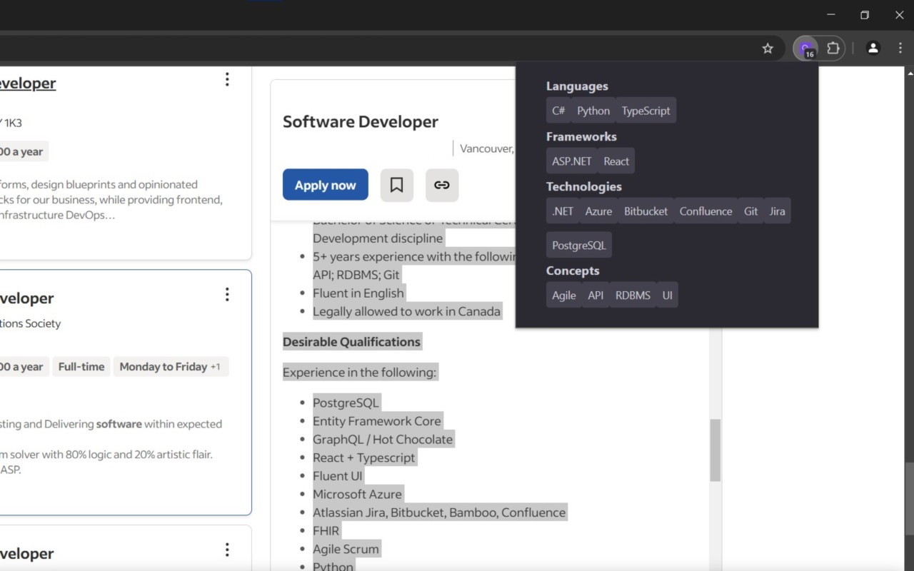

# Job Digest

Job Digest is a browser extension that extracts software engineering related keywords from selected text. The words are sorted by **"Languages"**, **"Frameworks"**, **"Technologies"**, and **"Concepts"**. Useful for resume tailoring. 

I'm sure there will be bugs and oversights, so feel free to submit any questions or issues.

